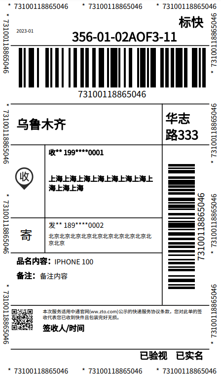
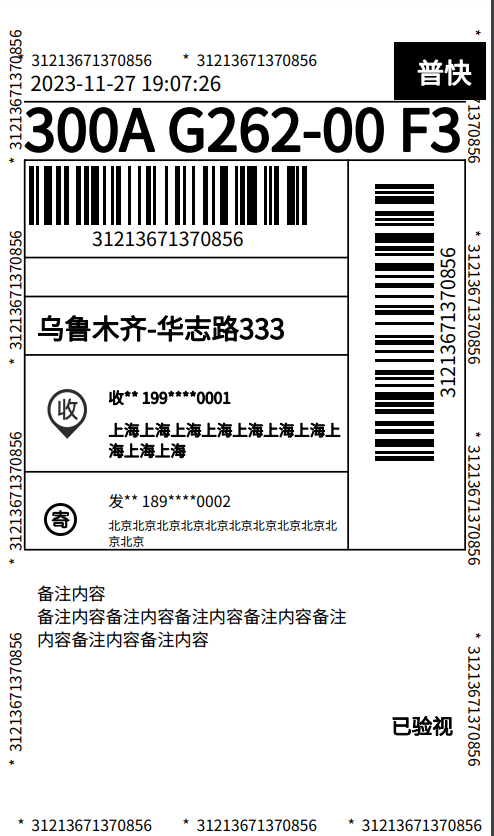
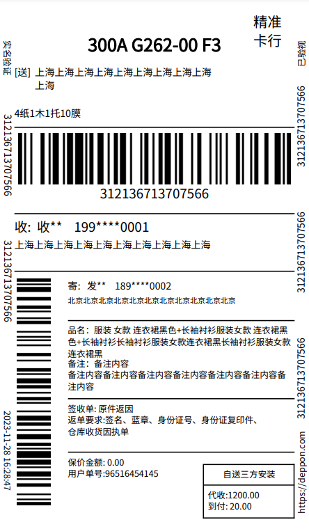
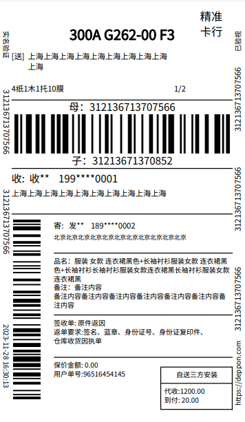
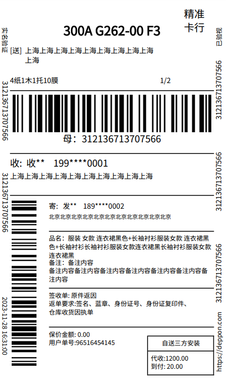

## 生成快递面单PDF文件

支持以下快递公司

`德邦`  `中通`  `韵达`

### 安装

~~~
composer require thefunpower/helper
composer require thefunpower/express_template
~~~

### 使用

~~~
cp vendor/express_template/img  到对应的web目录
~~~

### 中通面单

~~~
use ExpressTemplate\Zto;  
$zto = new Zto;
$zto->image_url = '';
//收 图片的URL地址
$zto->revice_img_url = "http://sf1/wp-content/plugins/express/lib/template/revice.png";
//底部左侧二维码的URL地址
$zto->qr_url         = "http://sf1/wp-content/plugins/express/lib/template/zto_qr.png";
//保存的路径 
$save_path = __DIR__.'/d.pdf'; 
$s = $zto->output([
    'time'=>'2023-01',
    'bill_code'=>73100118865046,//运单号
    'mark'=>'356-01-02AOF3-11',//大头笔
    'bag_addr_1'=>'乌鲁木齐', //集包地
    'bag_addr_2'=>'华志路333',
    'name'=>'IPHONE 100', //品名内容
    'desc'=>'备注内容', //备注
    'type'=>'标快',//
    //收货人
    'receiver'=>[
        'name'=>'收货人',
        'phone'=>'19900000001',
        'address'=>'上海上海上海上海上海上海上海上海上海上海',
    ],
    'sender'=>[
        'name'=>'发货人',
        'phone'=>'18900000002',
        'address'=>'北京北京北京北京北京北京北京北京北京北京北京',
    ],
    //'save_path'=> $save_path,
    //'return_content'=>true,
]);
echo $s;
~~~
 

### 韵达

~~~ 
use ExpressTemplate\Yd;  
$yd = new Yd; 
//收 图片的URL地址
$yd->revice_img_url = "http://sf1/wp-content/plugins/express/lib/template/revice.png";
$yd->sender_img_url = "http://sf1/wp-content/plugins/express/lib/template/sender.png";
//底部左侧二维码的URL地址
$yd->qr_url         = "http://sf1/wp-content/plugins/express/lib/template/db_qr.jpg";
//保存的路径 
$save_path = __DIR__.'/d.pdf'; 
$s = $yd->output([
    'time'=>now(),
    'bill_code'=>31213671370856,//运单号
    'mark'=>'300A G262-00 F3',//大头笔
    'bag_addr_1'=>'乌鲁木齐', //集包地
    'bag_addr_2'=>'华志路333',
    'name'=>'IPHONE 100', //品名内容
    'desc'=>'备注内容 备注内容备注内容备注内容备注内容备注内容备注内容备注内容', //备注
    'type'=>'普快',//
    //收货人
    'receiver'=>[
        'name'=>'收货人',
        'phone'=>'19900000001',
        'address'=>'上海上海上海上海上海上海上海上海上海上海',
    ],
    'sender'=>[
        'name'=>'发货人',
        'phone'=>'18900000002',
        'address'=>'北京北京北京北京北京北京北京北京北京北京北京',
    ],
    //'save_path'=> $save_path,
    //'return_content'=>true,
]);
echo $s;
~~~

### 德邦
~~~
use ExpressTemplate\Db;  
$yd = new Db; 
//收 图片的URL地址
$yd->revice_img_url = "http://sf1/wp-content/plugins/express/lib/template/revice.png";
$yd->sender_img_url = "http://sf1/wp-content/plugins/express/lib/template/sender.png";
//底部左侧二维码的URL地址
$yd->qr_url         = "http://sf1/wp-content/plugins/express/lib/template/db_qr.jpg";
//保存的路径 
$save_path = __DIR__.'/d.pdf'; 
$s = $yd->output([
    'time'=>now(),
    'bill_code'=>312136713707566,//运单号
    //子单
    'sub_bill_code'=>312136713707566,//子单号，首次与bill_code值相同
    'sub_title'=>'1/2',//子单/总数
    // 
    'title'=>'4纸1木1托10膜',    
    'mark'=>'300A G262-00 F3',//大头笔
    'bag_addr_1'=>'乌鲁木齐', //集包地
    'bag_addr_2'=>'华志路333',
    'name'=>'服装 女款 连衣裙黑色+长袖衬衫服装女款 连衣裙黑色+长袖衬衫长袖衬衫服装女款连衣裙黑长袖衬衫服装女款 连衣裙黑', //品名内容
    'desc'=>'备注内容 备注内容备注内容备注内容备注内容备注内容备注内容备注内容', //备注
    'type'=>'普快',//
    //收货人
    'receiver'=>[
        'name'=>'收货人',
        'phone'=>'19900000001',
        'address'=>'上海上海上海上海上海上海上海上海上海上海',
    ],
    'sender'=>[
        'name'=>'发货人',
        'phone'=>'18900000002',
        'address'=>'北京北京北京北京北京北京北京北京北京北京北京',
    ],
    //'save_path'=> $save_path,
    //'return_content'=>true,

    'notice'=>'精准卡行',
    'desc1'=>'签收单: 原件返因 返单要求:签名、蓝章、身份证号、身份证复印件、仓库收货因执单',
    'desc2'=>'保价金额: 0.00 用户单号:96516454145',
    'tip1'=>'自送三方安装',
    'tip2'=>'代收:1200.00 到付: 20.00',
]);
echo $s; 
~~~

### 开源协议 

[LICENSE](LICENSE)
 
  
 