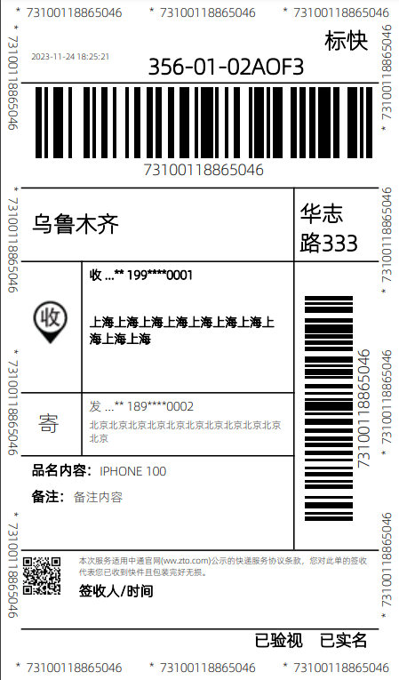

## 快递面单打印模板
 

### 安装

~~~
composer require thefunpower/express_template
~~~

### 使用

~~~
cp vendor/express_template/img  到对应的web目录
~~~

### 中通面单

~~~
use ExpressTemplate\Zto;  
$zto = new Zto;
$zto->image_url = 'http://sf1/wp-content/plugins/express/lib';
//收 图片的URL地址
$zto->revice_img_url = "";
//底部左侧二维码的URL地址
$zto->qr_url         = "";
//保存的路径 
$save_path = __DIR__.'/d.pdf'; 
$zto->output([
    'bill_code'=>73100118865046,//运单号
    'mark'=>'356-01-02AOF3',//大头笔
    'bag_addr_1'=>'乌鲁木齐', //集包地
    'bag_addr_2'=>'华志路333',
    'name'=>'IPHONE 100', //品名内容
    'desc'=>'备注内容', //备注
    'type'=>'标快',//
    //收货人
    'receiver'=>[
        'name'=>'收货人',
        'phone'=>'19900000001',
        'address'=>'上海上海上海上海上海上海上海上海上海上海',
    ],
    'sender'=>[
        'name'=>'发货人',
        'phone'=>'18900000002',
        'address'=>'北京北京北京北京北京北京北京北京北京北京北京',
    ],
    //保存PDF到指定目录
    //'save_path'=> $save_path,
    //返回PDF内容
    //'return_content'=>true,
]);
~~~

效果

### 开源协议 

[LICENSE](LICENSE)
 
  
 